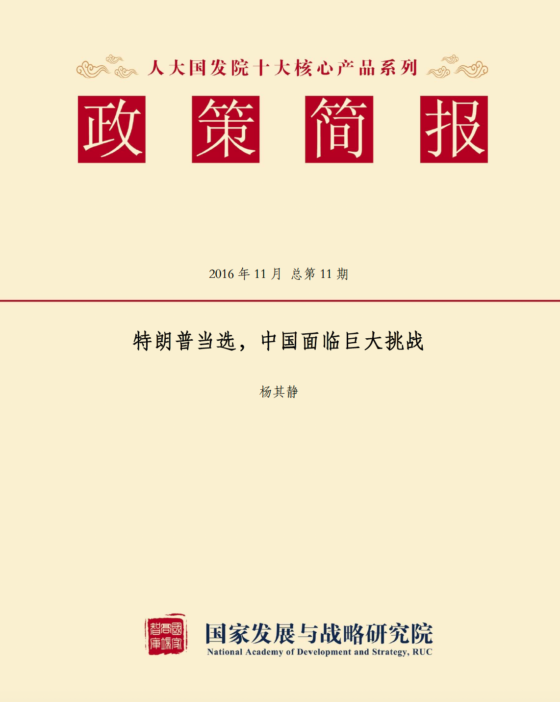
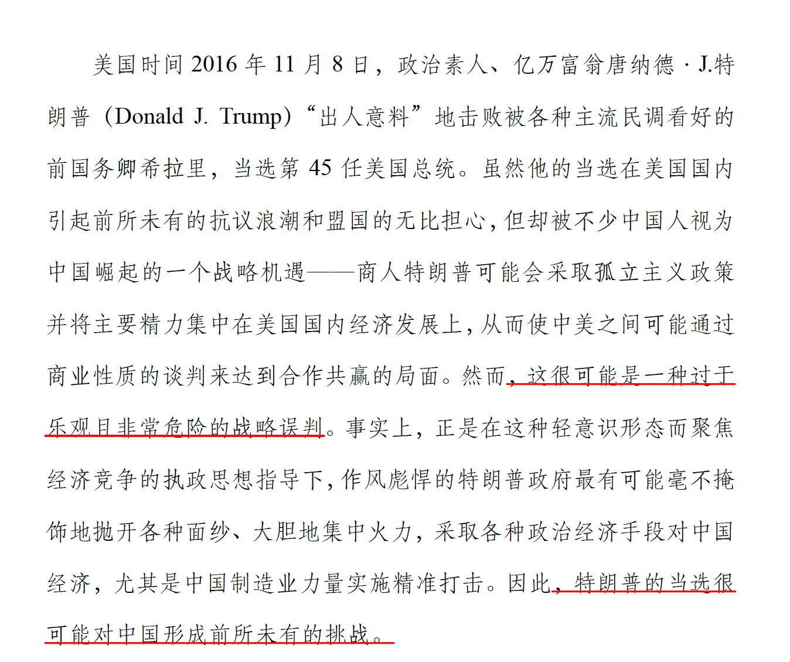
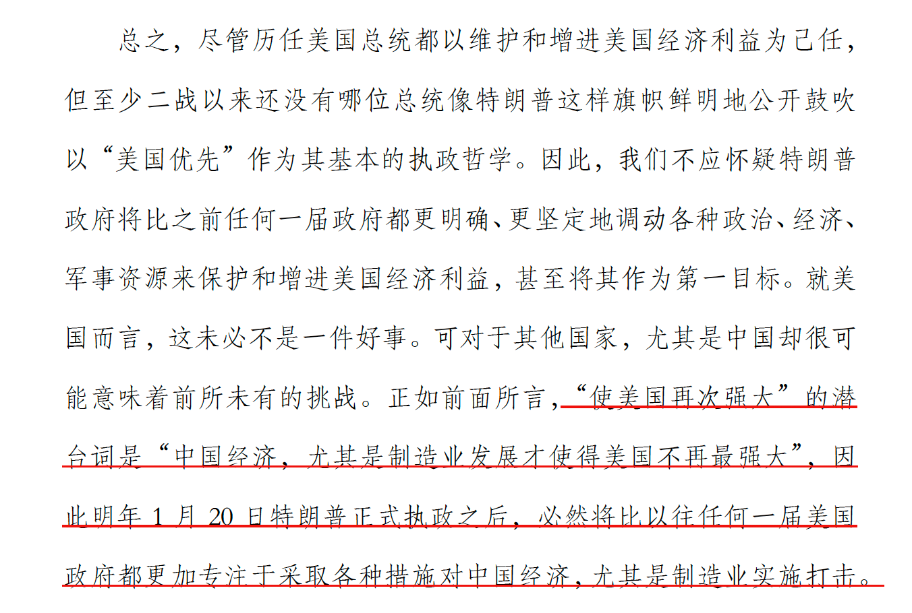
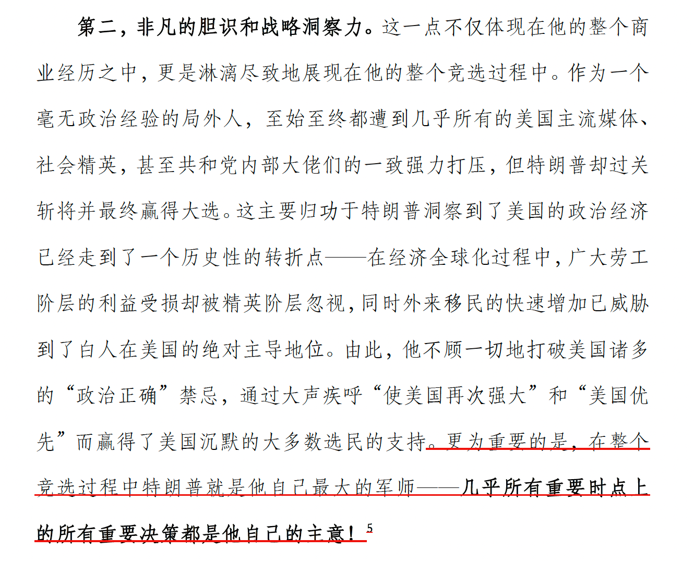
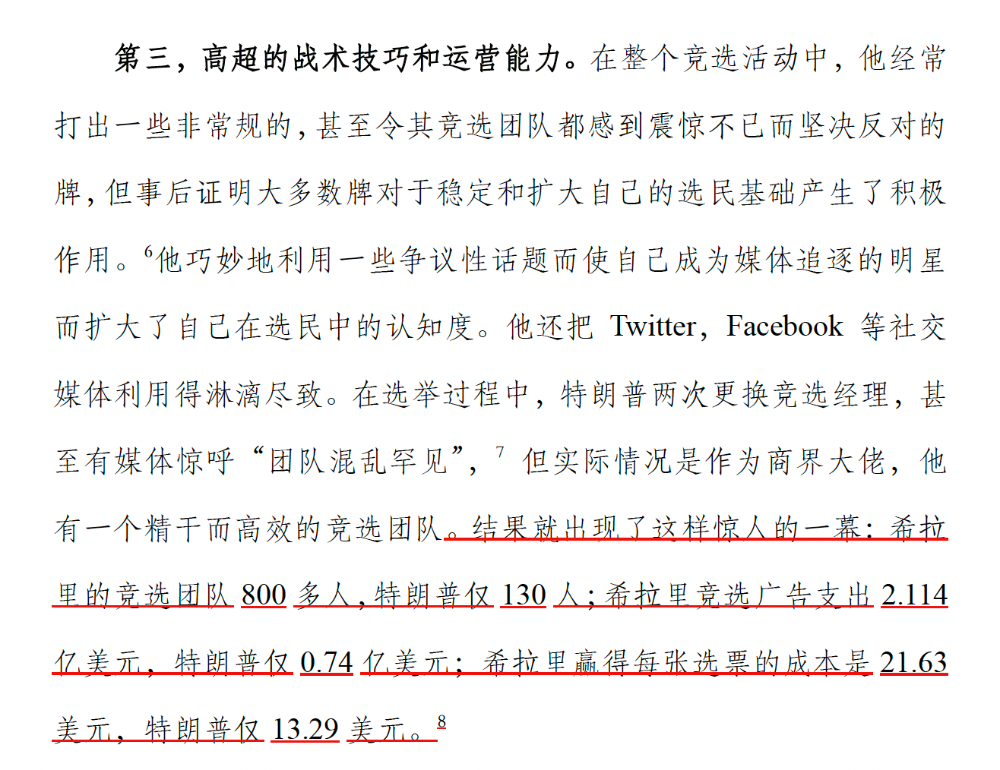
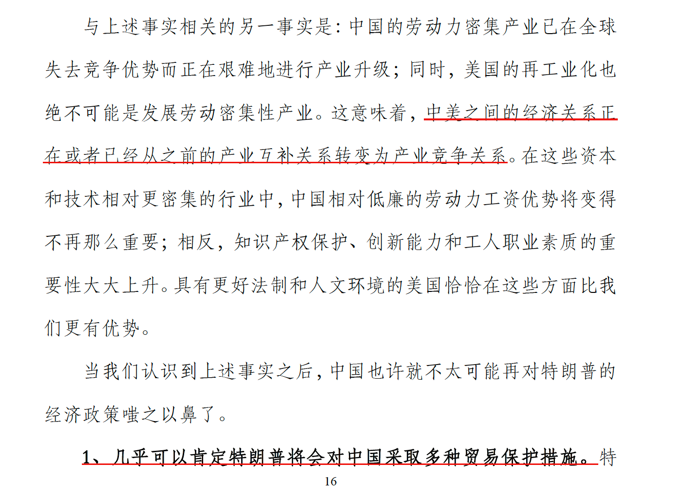
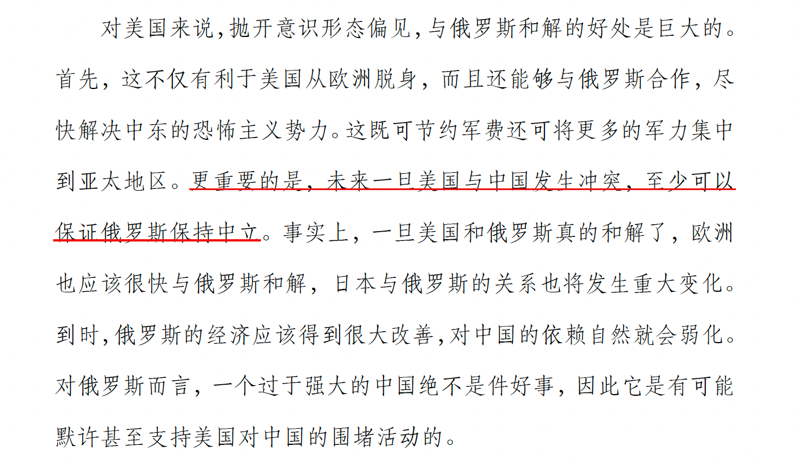
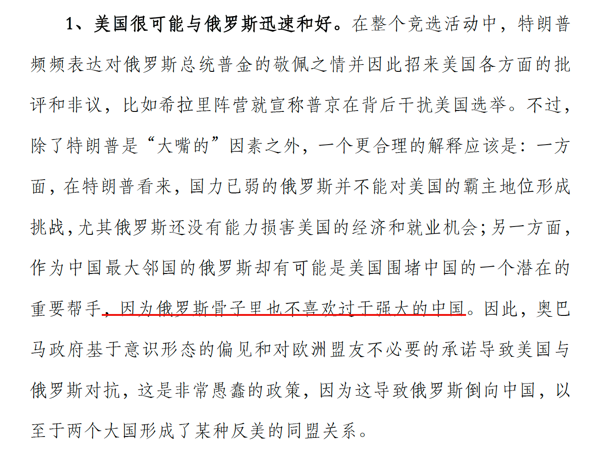
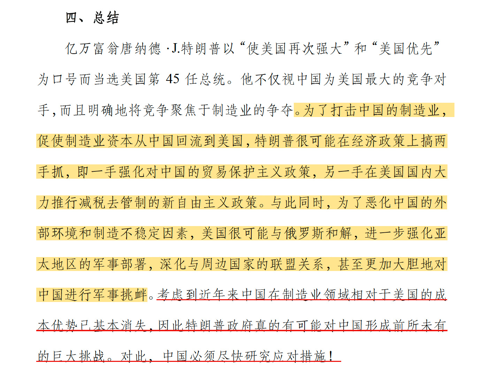

这份2016年的研究报告来自[人大国发院](http://nads.ruc.edu.cn/zkcg/zcjb/index.htm)，特朗普刚刚竞选获胜，全世界还在震惊于这么一个不靠谱的政治素人，在一路群嘲和不看好的跌跌撞撞中，竟然还真给他选上了。

那时候国内有一种观点，认为这个商人出身的新总统看重实际利益高过意识形态，会更加务实地聚焦国内事务，从而利好我国将迎来一个更加宽松的国际环境。

然而，这篇报告认为这个预计太过乐观。事实上，这是严重的战略误判。作者认为特朗普绝非善类，其政策核心是判断从克林顿到奥巴马这几任政府对中国让步太多损害了美国利益，进而一定会祭出贸易保护主义促使美国资本回流，对中国制造业实施精准打击，并在地缘上通过缓和与俄罗斯的关系来围堵中国。

作者从特朗普最著名的竞选口号：“让美国再次伟大”、“美国优先”入手，分析得出中国才是这两个口号背后的潜台词，即中国过去几十年迅猛的发展势头，尤其是成为世界制造工厂、让美国制造业“空心化”，使美国失去了往日制造业强国的荣光。

而美国优先背后则是公开确认聚焦于美国人自己的经济利益，而非为了各种“政治正确”、“普世价值”的意识形态在国际上承担过多的经济负担和义务。这一项更是直接奠定了特朗普基本的执政哲学，不谈虚头巴脑的人文情怀、救世济民，只看丁卯分明的经济账。在这种哲学的指导下，美国对中国的基本政策势必将发生根本转变，先前的合作方式将被认为是“让步太多”、损害美国人自己的经济利益，转为促进资本回流、保护本国就业。

接着，作者分析特朗普本人的性格特征，发现其过往成功的从商经历，在本应享受天伦的年纪转为参选总统的笃定，以及竞选过程中体现出来的高超的运营能力、胆识洞察力、不屈不挠、不择手段的特质，得出结论：这是一个“超级挑战者”，而不绝不是什么素人新手。这说明，特朗普提出的两个口号背后的战略意图，其本人绝对有强大的意志和能力将其付诸实现。

最后，基于对意图和人物的分析，作者得出了基本结论：

> 特朗普政府将对中国形成巨大挑战。

这个挑战主要来自两方面。

一方面是经济政策。通过对中美制造业成本的分析得知，中美之间的经济关系正在或已经从先前的互补关系转变为竞争关系。在上述执政哲学思路下，几乎可以肯定，美国对外将采取贸易保护主义的措施，中国在其中必然会受到巨大的影响。对内采取新自由主义，实施减税并放松管制，从而促进资本回流。

另一方面，在地缘政治上，很可能如法炮制当年尼克松访华遏制苏联那样，通过缓和同俄罗斯的关系来遏制中国崛起，至少换取其在中美冲突时的中立。毕竟，俄罗斯也不希望看见一个过于强大的中国。

以上的种种都意味着，过去改革开放几十年全球化趋势下的世界格局和游戏规则将发生根本性的逆转，中国将面临巨大挑战。

后面的发展的发展都知道了：贸易战开启，关键技术被卡脖子；而中美贸易战期间，俄罗斯也是作壁上观、坐山观虎斗。

这种转变背景下，中国制造业成本优势不再，产业升级遭遇巨大困难和阻力，外贸作为增长引擎的高增长不复存在转而寻求明眼人都知道不靠谱的所谓内循环，经济放缓的情况下先前隐蔽的房地产和地方债务问题开始凸显乃至暴雷。

结果就是：中国在2018年之前步步为营、一路高歌猛进的强势增长和崛起复兴进程，似乎到此戛然而止，甚至开始掉转头向下。

按照这份报告的预测，基本可以说：全中。  

如今8年后特朗普再次回归，新一届美国政府会采取怎样的政策？未来4年走势风向？

这分报告仍有很强的参考意义。  

此外，里面的分析思路、框架结构、行文风格、基于数据和材料的逻辑论证，非常值得学习。

附：报告部分截图

